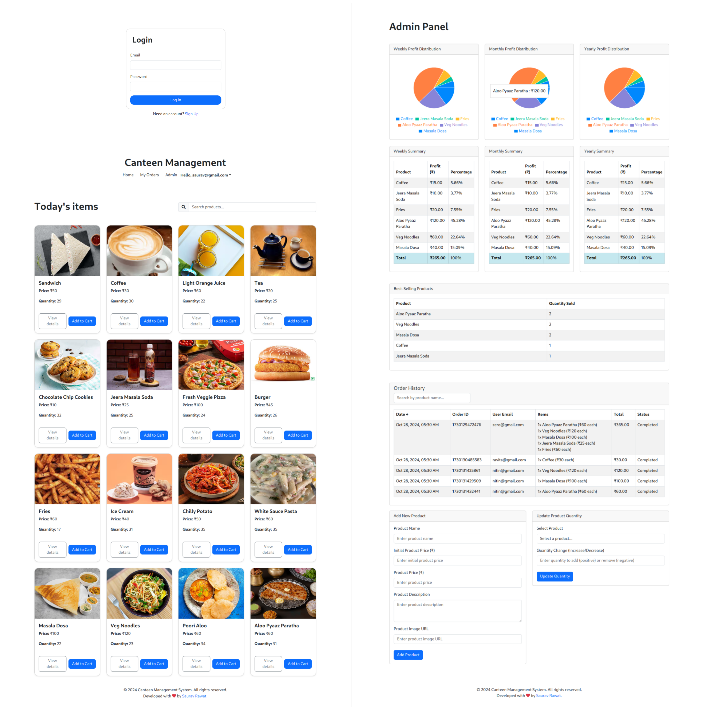
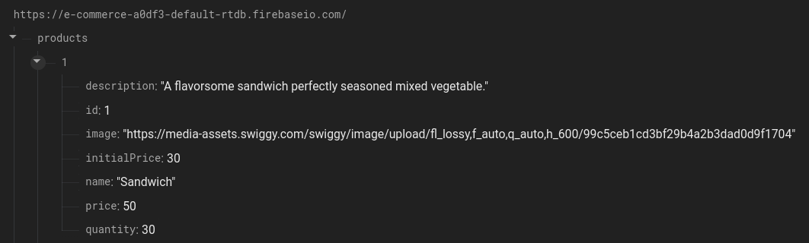
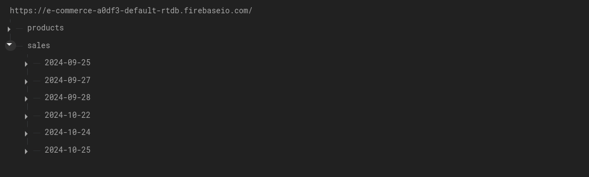

# Canteen Management System



## Overview

The Canteen Management System is a web-based application designed to streamline food ordering processes in canteens or cafeteria settings. Built with **React** and **Firebase**, this application offers an intuitive interface for users to browse products, add items to a cart, and complete purchases. Additionally, it provides order history features for users and administrators, with data visualization and PDF export options for easy record-keeping.

**[Live Demo](https://sauravrwt.github.io/Canteen-Management/)**

## Features

- **Product Catalog**: A browsable list of available food items with details like name, price, and quantity.
- **Search Functionality**: A search bar to quickly find specific products.
- **Product Details**: View in-depth details for each product by selecting an item.
- **Shopping Cart**: Add items to the cart, adjust quantities, and remove items as needed.
- **Checkout Process**: Simple, streamlined checkout process for completing purchases.
- **Real-time Updates**: Product quantities are automatically updated in real-time using Firebase.
- **Order History**: 
  - **User Order History**: Allows users to track their own past orders.
  - **Admin Order History**: Enables administrators to view the full order history of all users.
- **Data Visualization**: Using `Recharts`, users and admins can visualize order data for insights into ordering trends.
- **PDF Export**: Integrated `jspdf` to allow users and admins to export order history as PDF files for easy offline reference.
- **Advanced Reporting**: Built-in reporting with visual analytics to track weekly, monthly, and yearly sales performance in the admin panel.
- **Responsive Design**: Fully responsive layout for seamless use on desktop and mobile devices.
- **Secure Authentication**: Integrated **Firebase Authentication** for secure login and user management.

## Technologies Used

- **React.js** for front-end development
- **Firebase (Realtime Database & Authentication)** for real-time data handling, storage, and secure user management
- **Bootstrap 5** and **React Bootstrap** for UI components
- **Recharts** for data visualization
- **JSPDF** for exporting data as PDF files

## Installation and Setup

Follow these steps to set up the project locally:

1. **Clone the Repository**:
   ```bash
   git clone https://github.com/SauRavRwT/canteen-management-system.git
   ```

2. **Navigate to the Project Directory**:
   ```bash
   cd canteen-management-system
   ```

3. **Install Dependencies**:
   ```bash
   npm install
   ```

4. **Set Up Firebase**:
   - Create a Firebase project at [Firebase Console](https://console.firebase.google.com/)
   - Add a web app to your Firebase project
   - Enable Firebase Authentication for secure user management
   - Copy the Firebase configuration and create a `firebase.js` file in the project root with your configuration:

     ```javascript
     // firebase.js
     export const firebaseConfig = {
       apiKey: "your_api_key",
       authDomain: "your_auth_domain",
       databaseURL: "your_databaseurl",
       projectId: "your_project_id",
       storageBucket: "your_storage_bucket",
       messagingSenderId: "your_messaging_sender_id",
       appId: "your_app_id"
     };
     ```

   

5. **Start the Development Server**:
   ```bash
   npm start
   ```

6. Open the application in your browser at [http://localhost:3000](http://localhost:3000).

## Usage

1. **Browse Products**: View a list of available products on the homepage.
2. **Search for Items**: Use the search bar to quickly locate items.
3. **View Product Details**: Click on a product to see more details, such as a description, available quantity, and price.
4. **Manage Cart**: Add products to your cart, adjust quantities, and remove items if needed.
5. **Checkout**: Proceed to checkout to place your order.
6. **User Authentication**: Log in to access personalized features such as order history.
7. **View Order History**:
   - **User View**: Access your own order history.
   - **Admin View**: Access the full order history for all users, with options to visualize data and export as PDF.
8. **Advanced Reporting**: The admin panel includes visual reports on weekly, monthly, and yearly performance, offering insights into sales trends.

## Recent Updates

- **Order History**: 
  - **User Order History**: Users can view their own order history.
  - **Admin Order History**: Admins can access the complete order history for all users, streamlining record-keeping and inventory management.

- **Recharts Integration**: Data visualization with `Recharts` enables users and admins to understand ordering trends and make data-driven decisions.

- **PDF Generation**: Integrated `jspdf` allows users and admins to export order history as PDF files, useful for offline record-keeping and administrative purposes.

## Contributing

We welcome contributions! If you’d like to help improve this project, feel free to fork the repository and submit a Pull Request.
